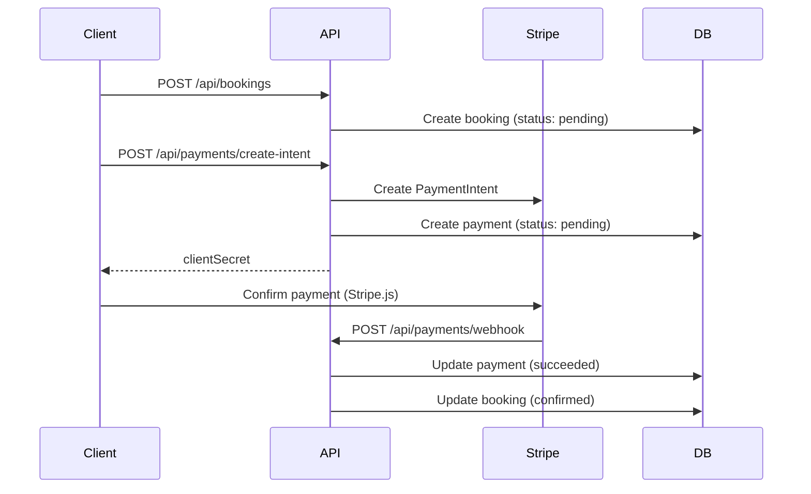

# Hotel Booking System API

Welcome to the Hotel Booking System API development repository. This is a modular, production-ready backend project built on a systematic weekly progression.

---

## WEEK 4: Payment Integration using Stripe

This week adds Stripe payment processing — payment intents linked to bookings, webhook-driven confirmation, and full/partial refund support on cancellation.

### Folder Structure
```text
/config
  ├── database.js           # MongoDB connection
  └── stripe.js             # Stripe SDK initialization
/controllers
  ├── hotelController.js
  ├── roomController.js
  ├── bookingController.js  # Updated: auto-refund on cancellation
  └── paymentController.js  # Payment intents, webhooks, refunds
/middleware
  └── error.js
/models
  ├── Hotel.js
  ├── Room.js
  ├── User.js
  ├── Booking.js
  └── Payment.js            # Payment records linked to bookings
/routes
  ├── hotelRoutes.js
  ├── roomRoutes.js
  ├── bookingRoutes.js
  └── paymentRoutes.js
/utils
  ├── seedData.js
  ├── errors.js
  ├── roomAvailability.js
  └── paymentService.js     # Refund logic and webhook handlers
.env.example                # Environment variable template
server.js
```

---

## Setup Instructions

### 1. Prerequisites
- [Node.js](https://nodejs.org/) (v16+)
- [MongoDB](https://www.mongodb.com/) (local or Atlas)
- [Stripe account](https://dashboard.stripe.com/register) (free test mode)

### 2. Installation
```bash
npm install
```

### 3. Environment Setup
Copy `.env.example` to `.env` and configure:
```env
PORT=5000
MONGODB_URI=mongodb://localhost:27017/hotel_booking

# Get test keys from https://dashboard.stripe.com/test/apikeys
STRIPE_SECRET_KEY=sk_test_...
STRIPE_WEBHOOK_SECRET=whsec_...
```

### 4. Stripe Webhook (Local Development)
Use the [Stripe CLI](https://stripe.com/docs/stripe-cli) to forward webhook events:
```bash
stripe listen --forward-to localhost:5000/api/payments/webhook
```
Copy the webhook signing secret (`whsec_...`) into your `.env` as `STRIPE_WEBHOOK_SECRET`.

### 5. Seed & Run
```bash
npm run seed
npm run dev
```

---

## Payment Flow



---

## API Endpoints

### Payment Operations
| Method | Endpoint | Description |
|--------|----------|-------------|
| `POST` | `/api/payments/create-intent` | Create Stripe PaymentIntent for a booking |
| `POST` | `/api/payments/webhook` | Stripe webhook (raw body, not for direct use) |
| `GET` | `/api/payments/:id` | Get payment details by ID |
| `GET` | `/api/payments/booking/:bookingId` | Get payment for a booking |
| `POST` | `/api/payments/:id/refund` | Process full or partial refund |
| `POST` | `/api/payments/:id/confirm` | Manual confirm (dev only, no webhook needed) |

#### Create Payment Intent
```json
POST /api/payments/create-intent
{
  "bookingId": "<bookingId>"
}
```
Response:
```json
{
  "success": true,
  "data": {
    "paymentId": "...",
    "clientSecret": "pi_xxx_secret_xxx",
    "amount": 1155,
    "currency": "usd"
  }
}
```

#### Refund Payment (Partial)
```json
POST /api/payments/:id/refund
{
  "amount": 500
}
```
Omit `amount` for a full refund. If the booking isn't already cancelled, a full refund also cancels it.

### Booking Operations (Updated)
- **`PUT /api/bookings/:id/cancel`** — Cancels booking and automatically refunds any successful payment.

### All Previous Endpoints
See Week 3 sections below for hotel, room, and booking endpoints.

---

## Payment Model

| Field | Type | Description |
|-------|------|-------------|
| `booking` | ObjectId → Booking | Linked booking |
| `amount` | Number | Amount in USD |
| `stripePaymentId` | String | Stripe PaymentIntent ID |
| `status` | String | `pending`, `succeeded`, `failed`, `refunded`, `partially_refunded` |
| `paymentMethod` | String | e.g. `card` |
| `refundedAmount` | Number | Total amount refunded so far |
| `stripeRefundId` | String | Latest Stripe refund ID |

---

## Webhook Events Handled

| Event | Action |
|-------|--------|
| `payment_intent.succeeded` | Mark payment succeeded, confirm booking |
| `payment_intent.payment_failed` | Mark payment failed |

---

## Testing Without Frontend

1. Create a booking: `POST /api/bookings`
2. Create payment intent: `POST /api/payments/create-intent`
3. **Option A** — Use Stripe test card `4242 4242 4242 4242` via Stripe.js / Stripe CLI
4. **Option B (dev)** — Skip Stripe checkout and call `POST /api/payments/:paymentId/confirm` to simulate webhook confirmation locally

---

## Previous Weeks

- **Week 1**: Environment setup, MongoDB connection, Hotel CRUD API
- **Week 2**: Room & User models, advanced queries, database seeding
- **Week 3**: Booking management, availability checks, custom error handling
